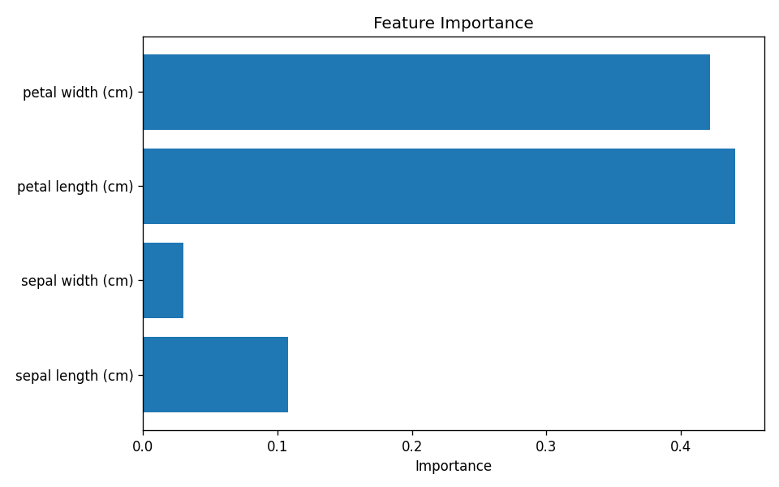
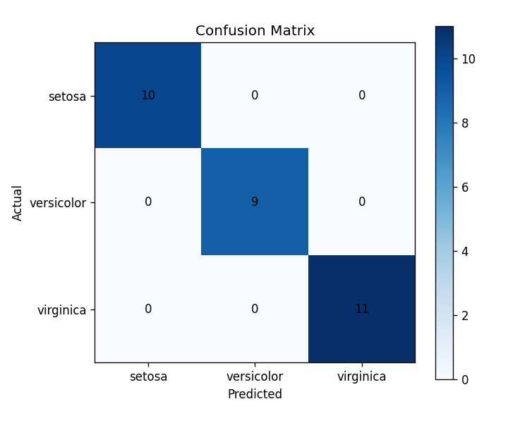

# Iris Classifier

> 📚 **Learning Project**: 機械学習の基本フローを学ぶための練習プロジェクト

アヤメの花の特徴量から品種を予測する機械学習モデル。
機械学習プロジェクトの基本フロー（データ読込→学習→評価→可視化→保存）を実装。

## 結果

- **精度: 100%** (テストデータ30件)
- 使用モデル: Random Forest Classifier

### 特徴量の重要度


### 混同行列


## 使用技術

- Python 3.12
- scikit-learn
- pandas
- matplotlib
- uv (パッケージ管理)

## セットアップ

### 必要環境
- [uv](https://github.com/astral-sh/uv) がインストール済みであること

### 手順

```bash
# リポジトリをクローン
git clone https://github.com/Nemyune/iris-classifier.git
cd iris-classifier

# 依存関係をインストール
uv sync

# 学習＆予測を実行
uv run python main.py
```

## ファイル構成

```
iris-classifier/
├── main.py              # メインスクリプト（学習・予測）
├── pyproject.toml       # 依存関係
├── models/
│   └── iris_model.pkl   # 学習済みモデル
└── outputs/
    ├── feature_importance.png
    └── confusion_matrix.png
```

## 学んだこと

- scikit-learnを使った分類モデルの基本的な流れ
- pickleによるモデル保存と再利用
- matplotlibでの可視化（特徴量重要度・混同行列）
- uvによるモダンなPython環境管理

## ライセンス

MIT